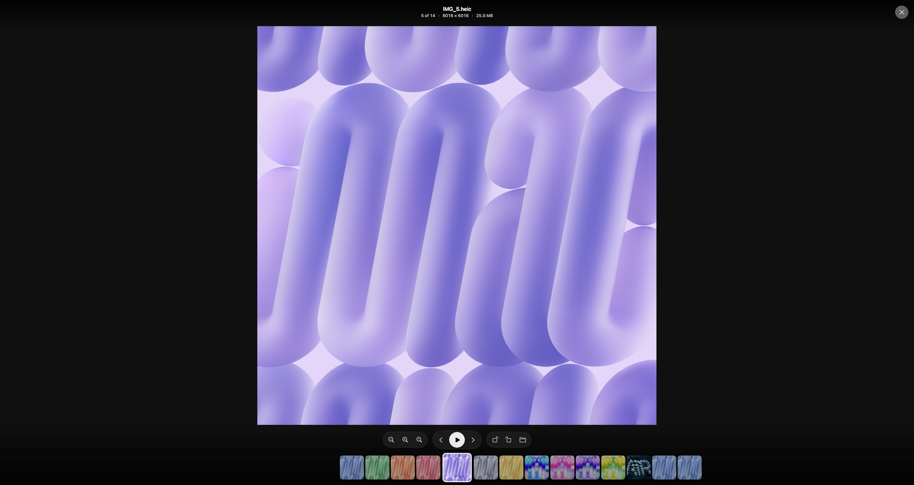
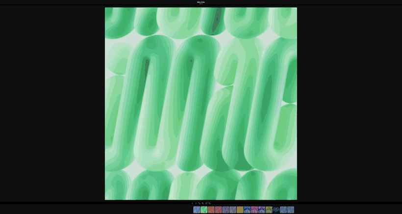
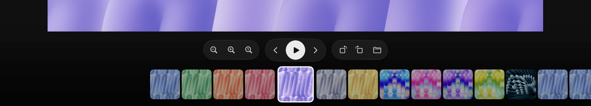
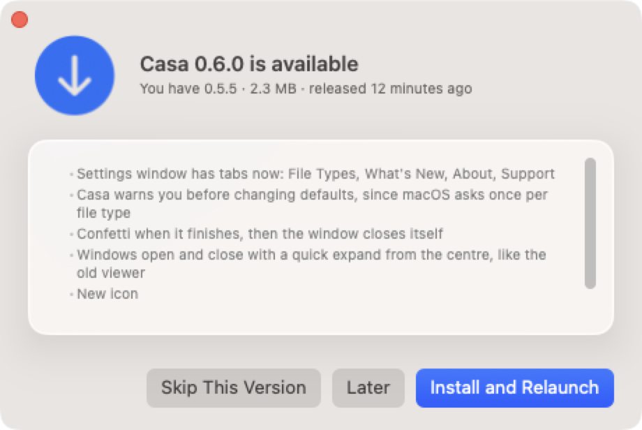
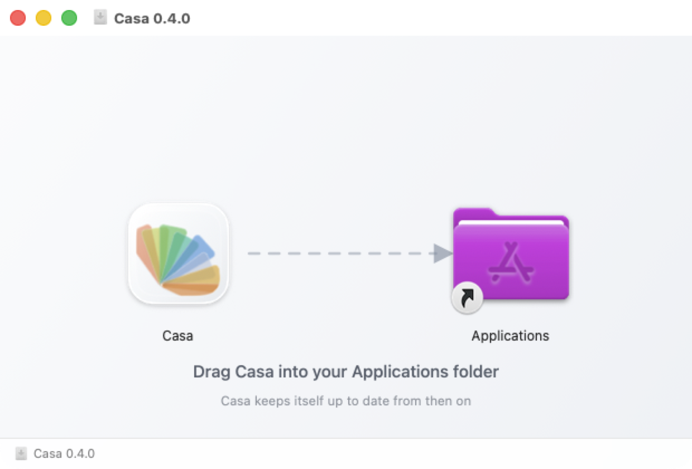
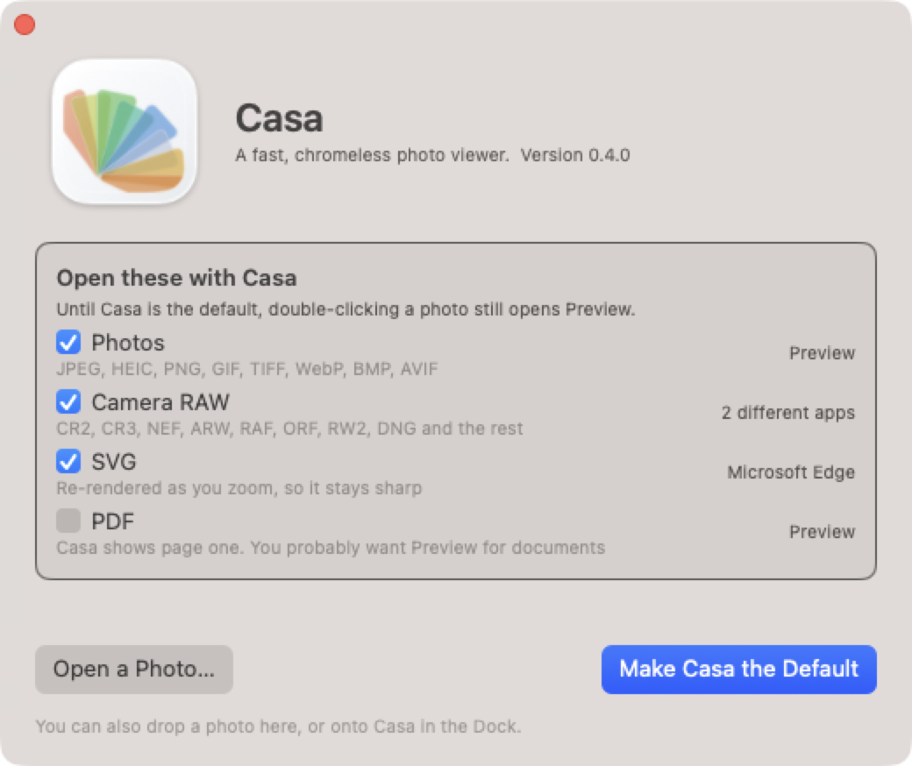

<div align="center">


# Casa

**A fast, chromeless photo viewer for macOS.**

Instant. Weightless. Gets out of the way.



</div>

---

Google's Picasa Photo Viewer appeared the instant you double-clicked a photo,
let you walk the whole folder with the arrow keys, and vanished when you pressed
Escape. Nothing on macOS does that. Preview doesn't pre-cache the next image, so
every arrow press is a cold decode — and it won't step outside the files you
explicitly opened.

Casa is that viewer, rebuilt for macOS.

## Arrow keys, with nothing in the way

<div align="center">

</div>

Navigation reaches the screen in **about a millisecond**. Neighbours are decoded
ahead at a cheap size, so holding an arrow key scrubs instead of stuttering, and
each photograph sharpens in place a beat later. The rail slides underneath a
fixed centre, so your eye never has to hunt for where you are.

<div align="center">

</div>

## It follows Finder's sort order

No other macOS viewer does this. Sort a folder by date added, open the third
photo, and every other viewer walks it alphabetically — quietly wrong, every
time.

Turn it on in **View › Use Finder's Sort Order**. Finder exposes its sort for
list and icon views; column and gallery views expose nothing at all, and fall
back to name order, which is also Finder's own default there.

## It updates itself

<div align="center">

</div>

Casa checks GitHub once a day, stays silent unless it has something to offer,
and installs in place — then relaunches and reopens the photograph you were
looking at.

Every download is verified against an **Ed25519 signature** before anything is
replaced. The private key never leaves the author's machine and is not in this
repository, so a compromised GitHub account is not enough to push a malicious
update. A SHA-256 digest check runs independently alongside it. Everything that
can fail does so *before* the running app is touched, and the swap itself is
atomic — the app on disk is entirely the old version or entirely the new one,
never a mixture.

## Formats

Everything ImageIO decodes — **62 types, 70 extensions** — including ~30 camera
RAW formats (CR2/CR3, NEF, ARW, RAF, ORF, RW2, PEF, DNG, IIQ, 3FR…), HEIC, AVIF,
WebP, JPEG XL, JPEG 2000, PSD, TGA, EXR, Radiance HDR and DICOM.

Plus three things ImageIO doesn't do:

- **PDF** — re-rendered as you zoom rather than magnified, so it stays crisp at 32×
- **SVG** — likewise
- **Video** — poster-framed into the same pipeline, so the rail and the
  preloader need no knowledge that an item is a movie

Malformed files are refused without incident. (`qlmanage` abort-traps on one of
the fixtures in the test corpus; Casa reports it and moves on.)

## Playback

Animated GIF, APNG, animated WebP, HEICS and video, driven by a single discrete
`CAKeyframeAnimation` — a looping GIF runs on the render server at **no CPU
cost** while the main thread decodes the next photo.

One setting, three outcomes, in **View › Playback**:

| | |
|---|---|
| **Click to Play** | The default. A folder of videos that all start talking at once is a worse first impression than one extra click. |
| **Play Automatically (Muted)** | |
| **Play Automatically (With Sound)** | |

Deliberately not three switches. "Autoplay?" and "Muted?" as independent
booleans produce a combination nobody designed and make you assemble the
behaviour you wanted out of parts.

## Keyboard

| Key | |
|---|---|
| `←` `→` | Previous / next |
| `⌥` + arrow, `Page Up/Down` | Jump 10 |
| `Home` / `End` | First / last |
| `Space` | Play, or next when there's nothing to play |
| `0` / `1` | Fit to window / actual size |
| Mouse wheel | Zoom **to the pointer** |
| Trackpad scroll / pinch | Pan / zoom |
| Double-click | Fit ⇄ 1:1, anchored where you clicked |
| `⌘C` / `⌥⌘C` / `⌘R` | Copy image / copy path / reveal in Finder |
| `⇧⌘[` `⇧⌘]` | Rotate |
| `⇧⌘D` | Hide Dock for a larger preview |
| `Esc` | Close |

A mouse wheel and a trackpad are different instruments and aren't mapped to the
same gesture: two-finger scroll means pan everywhere else on macOS, and a wheel
means zoom to anyone who used Picasa.

Full map in [`docs/keyboard.md`](docs/keyboard.md).

## Install

Download **`Casa-x.y.z.dmg`** from
[Releases](https://github.com/jackharvest/Casa/releases), mount it, and drag
Casa into Applications.

<div align="center">

</div>

Then launch it once. Casa is an app whose job begins when you double-click a
photo, so a bare launch shows you the one thing worth doing first — claiming
the file types, with whatever currently owns them shown beside each group:

<div align="center">

</div>

Casa ships registered as an *alternate* handler rather than seizing every image
on the machine, so this is entirely opt-in — and PDF is unchecked by default,
because you probably do want Preview for documents.

If macOS declines to change a default, Casa says so and tells you the manual
route (Get Info → Open with → Change All) rather than pretending it worked.

The `.zip` alongside the `.dmg` is what the updater installs; you don't need it.

## Build

No Xcode project. SwiftPM produces the binary; `Scripts/build-app.sh` wraps it
in the bundle layout Launch Services needs.

```sh
Scripts/build-app.sh release          # -> build/Casa.app
open -a build/Casa.app ~/Pictures/some.jpg
```

## Test

The corpus is synthesized from files macOS already ships, so nothing large is
committed and it reproduces on any Mac:

```sh
Scripts/make-corpus.sh                # -> build/corpus, build/corpus-large

# Format coverage. Exits non-zero on regression.
build/Casa.app/Contents/MacOS/Casa --selftest build/corpus
# 33/33 displayable · 2 animated · 2 video · 4/4 malformed rejected safely

# Navigation benchmark
build/Casa.app/Contents/MacOS/Casa build/corpus-large/IMG_1.heic --bench 40

log show --last 2m --info --debug \
    --predicate 'subsystem == "com.jackharvest.casa"' --style compact
```

```sh
# Geometry and version arithmetic, asserted against the real views
build/Casa.app/Contents/MacOS/Casa --selfcheck
```

Debug flags: `--bench <n>`, `--selftest <dir>`, `--selfcheck`, `--keep-chrome`,
`--screen <n>`, `--migrate-screens <a>,<b>`, `--finder-sort-probe <dir>`.

## Releasing

```sh
Scripts/keygen.sh                     # once — generates the signing key
echo 0.6.0 > VERSION
Scripts/release.sh --dry-run          # build, icon, package, sign, DMG; publish nothing
Scripts/release.sh
```

The icon is drawn procedurally by `Scripts/IconTools/MakeIcon.swift` — a
superellipse tray and eight multiply-blended blades — so there is no binary
master to keep in sync. `Scripts/make-icon.sh` renders all ten sizes and builds
the `.icns`; the DMG background is generated the same way.

`VERSION` is the single source of truth, stamped into `Info.plist` at build
time; the build number is the commit count.

## Principles

**Paint both sides of the fence.** The internals get the same care as what's
visible. There is no part of this app that is "just" plumbing.

**Nothing hardcodes a size.** Every dimension derives from the user's resolved
text size, so display density, system text size and SF Symbol optical scaling
all move together. Reduce Transparency, Reduce Motion, Increase Contrast and
Differentiate Without Color are treated as layout inputs, not afterthoughts —
an app whose whole premise is a translucent overlay has to honour the setting
that turns translucency off.

**Gobs of convenience, not gobs of knobs.** Where a setting is needed it gets
one control with named outcomes.

**Measure, don't assume.** Twenty findings in
[`docs/performance-log.md`](docs/performance-log.md), each one a thing that
sounded obviously true and wasn't. A few samples: asking ImageIO for a smaller
image doesn't give you a cheaper decode; `.background` priority bounds *who
wins*, not *how many run*; a byte-ceiling cache leaks because Core Animation's
GPU-side copies are invisible to it.

## Four ideas the code is organised around

**The decode ladder.** Never decode more than you're about to show. Five rungs,
cheapest first — a filmstrip thumbnail, the camera's embedded preview, a small
real decode, screen resolution, and the full bitmap only once someone zooms past
it.

**Memory bounded by shape, not accounting.** One slot for the sharp image;
count-bounded sets of previews and thumbnails. A budget you have to remember to
enforce is a budget that leaks.

**Bounded concurrency.** Screen-resolution decodes are serialised, and thumbnail
decodes yield to them. Learned twice, expensively.

**One state at a time.** The update panel is a pure function of a single value,
not a set of booleans that can contradict each other.

## Docs

- [`docs/NOTES.md`](docs/NOTES.md) — full project handoff: state, environment,
  commands, open items, traps
- [`docs/performance-log.md`](docs/performance-log.md) — every measured finding
- [`docs/keyboard.md`](docs/keyboard.md) — the full keyboard and pointer map
- [`docs/landscape.html`](docs/landscape.html) — competitive research: why this
  exists and what the macOS viewer field actually looks like

## Status

Early, but the core loop is solid. Cold launch is ~465 ms and is the one number
still short of target; `docs/NOTES.md` says exactly where the unexplained 120 ms
sits.

---

## Author

Built by **Jack Harvest** — software developer by day.

Casa is a personal project built with heavy use of AI coding tools. The
architecture, the measurements and the decisions are mine; the tooling helped me
move a great deal faster than I would have alone. Every number in
`docs/performance-log.md` was measured on real hardware, not assumed.

Licensed under the [MIT License](LICENSE).
