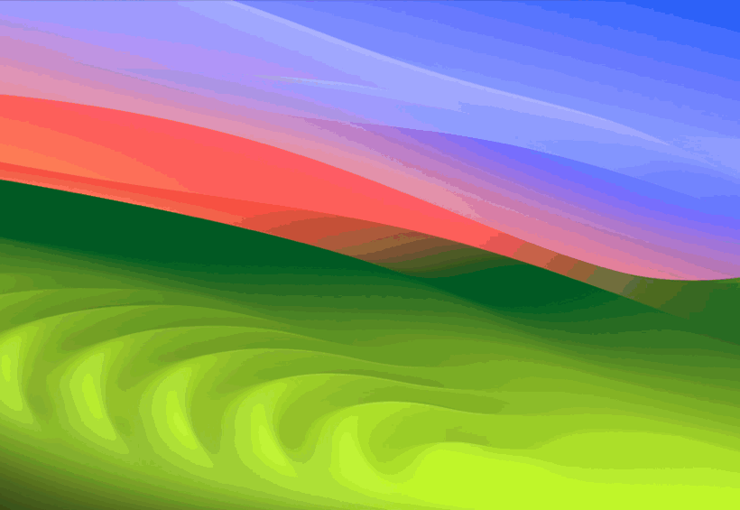
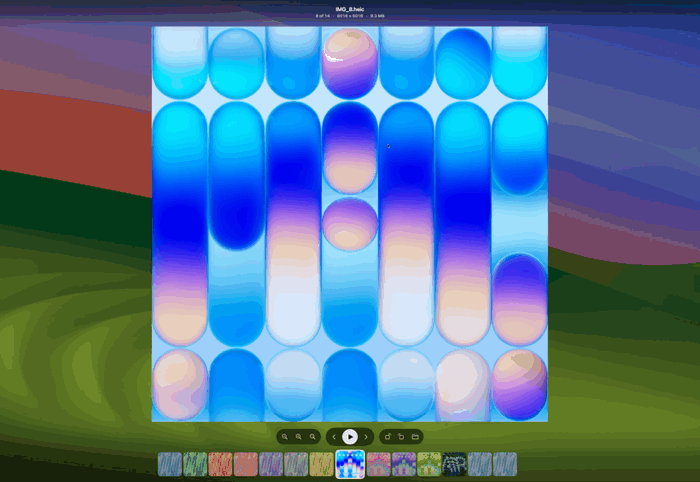
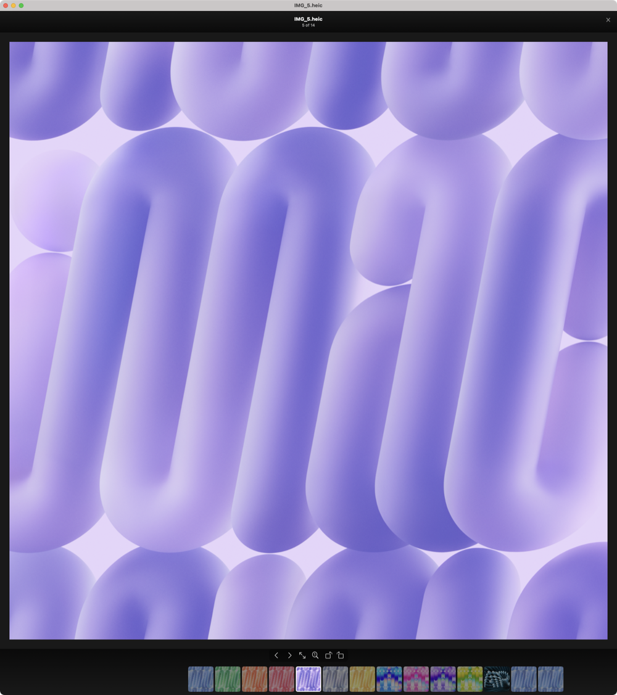

<div align="center">


# Casa

**A fast, free photo viewer for the Mac, in the spirit of the old Picasa Photo Viewer.**

[**Download for macOS**](https://github.com/jackharvest/Casa/releases/latest)


</div>

---

Remember Picasa's photo viewer? You double-clicked a photo and it was just
*there*, floating over your desktop. The arrow keys flipped through the folder
instantly. The scroll wheel zoomed right where you pointed. Press Escape and it
was gone.

Nothing on the Mac has felt like that since. Casa does.

## It pops open instantly

<div align="center">

</div>

Double-click a photo. The screen dims and the photo zooms out of the middle,
with your desktop still right there behind it. Press Escape and it shrinks
away.

## Flip through the whole folder

<div align="center">

</div>

Tap the arrow keys and the next photo is already there. There's no waiting,
even on huge camera files. The filmstrip slides along underneath: scroll over
it to fly through a folder, or click any thumbnail to jump straight to it.

Sort a folder in Finder, and Casa can walk it in that same order
(**View › Use Finder's Sort Order**).

## Zoom right where you point

<div align="center">

</div>

Scroll the wheel and it zooms smoothly into whatever is under your pointer. The
percentage shows beside it. Double-click to zoom in on a spot, and double-click
again to see the whole photo.

## Just enough buttons

Zoom, previous and next, a slideshow, rotate, and show in Finder. Everything
fades away when you stop moving the mouse, so it's just you and the photo.
Rotating saves to the file, without losing any quality.

## Full screen, or a window

Click the dark area beside the photo, or press Return, and Casa turns into a
normal window that hugs the picture. Press Return again to go back to full
screen.

<div align="center">

</div>

## Opens just about everything

JPEG, HEIC, PNG, GIF, WebP, AVIF, TIFF, PSD, and RAW files from nearly every
camera brand. PDF and SVG stay sharp however far you zoom. Animated GIFs and
videos play. Transparent images show a checkerboard behind them, so you can
see the edges.

## Keyboard

| Key | |
|---|---|
| `←` `→` | Previous / next photo |
| `↑` `↓` | Zoom in / out |
| `1` | Actual size, or back to fit |
| `S` | Slideshow |
| `Space` | Next photo, or play a video |
| `Return` | Full screen or window |
| `⇧⌘[` `⇧⌘]` | Rotate |
| `⌘C` | Copy the photo |
| `⌘R` | Show in Finder |
| `Esc` | Close |

Every shortcut is in [`docs/keyboard.md`](docs/keyboard.md).

## Install

1. Download the `.dmg` from
   [Releases](https://github.com/jackharvest/Casa/releases/latest), open it,
   and drag Casa into Applications.

   

2. Open Casa once. The first time, macOS will say it can't check the
   developer. Go to **System Settings › Privacy & Security** and click
   **Open Anyway**. On older versions of macOS, right-click Casa and choose
   **Open** instead.

3. Click **Make Casa the Default**, so double-clicking a photo opens Casa.

   

That's it. Casa keeps itself up to date and tells you when there's something
new.

<div align="center">

</div>

Requires macOS 14 or later.

## For developers

Casa is written in Swift and builds with SwiftPM:

```sh
Scripts/build-app.sh release      # -> build/Casa.app
```

Everything else, including how it works, testing and releasing, is in
[`docs/NOTES.md`](docs/NOTES.md).

---

## Author

Built by **Jack Harvest**, software developer by day.

Casa is a personal project. I used AI coding tools heavily; the architecture,
the measurements and the calls are mine. Every number in the performance log was
measured on real hardware.

[MIT licensed](LICENSE). If it saved you time,
[buy me a coffee](https://buymeacoffee.com/jackharvest).

<sub>Casa is not affiliated with or endorsed by Google. Picasa is a trademark of
Google LLC.</sub>
