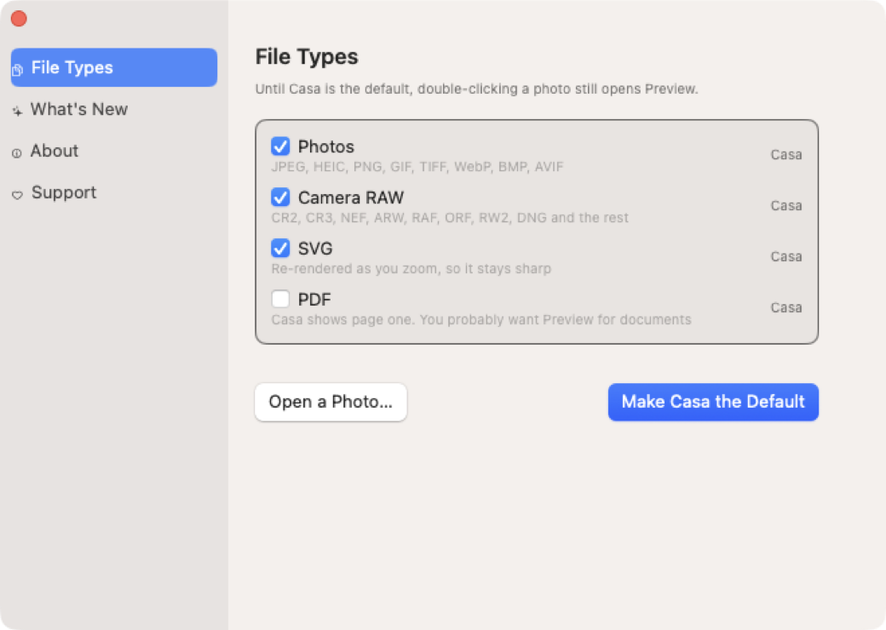

<div align="center">


# Casa

**A fast photo viewer for macOS.**


</div>

---

Picasa's photo viewer opened the instant you double-clicked a photo, let you
walk the folder with the arrow keys, and disappeared when you pressed Escape.
Nothing on macOS does that. Preview doesn't cache the next image, so every arrow
press is a fresh decode, and it won't step outside the files you opened.

Casa is that viewer, for macOS.

## Arrow keys

<div align="center">

</div>

The next photo appears in about a millisecond. Casa decodes the neighbours ahead
of time at a small size, so holding an arrow key scrubs smoothly, and each photo
sharpens a moment later. The rail slides under a fixed centre so you always know
where you are.

<div align="center">

</div>

## It follows Finder's sort order

No other Mac viewer does this. Sort a folder by date added, open the third
photo, and everything else walks it alphabetically.

Turn it on in **View › Use Finder's Sort Order**. Finder reports its sort for
list and icon views. Column and gallery views don't expose it, so those fall
back to name order, which is what Finder does there anyway.

## It updates itself

<div align="center">

</div>

Casa checks GitHub once a day and stays quiet unless there's something new. It
installs in place, then relaunches and reopens the photo you were looking at.

Downloads are checked against an Ed25519 signature before anything is replaced.
The signing key isn't in this repo, so someone who got into the GitHub account
still couldn't push an update Casa would accept. There's a SHA-256 check
alongside it. If any of it fails, nothing is touched.

## Formats

Everything ImageIO can read: 62 types, 70 extensions. That includes about 30
camera RAW formats (CR2/CR3, NEF, ARW, RAF, ORF, RW2, PEF, DNG, IIQ, 3FR),
HEIC, AVIF, WebP, JPEG XL, JPEG 2000, PSD, TGA, EXR, Radiance HDR and DICOM.

Plus three things ImageIO doesn't do:

- **PDF**, re-rendered as you zoom instead of magnified, so it stays sharp
- **SVG**, same
- **Video**, with a poster frame in the rail

Broken files get refused rather than crashing anything.

## Playback

Animated GIF, APNG, WebP, HEICS and video. Animations run as a single Core
Animation keyframe animation, so a looping GIF costs no CPU.

One setting in **View › Playback**: Click to Play (default), Play Automatically
(Muted), or Play Automatically (With Sound).

## Keyboard

| Key | |
|---|---|
| `←` `→` | Previous / next |
| `⌥` + arrow, `Page Up/Down` | Jump 10 |
| `Home` / `End` | First / last |
| `Space` | Play, or next if there's nothing to play |
| `0` / `1` | Fit to window / actual size |
| Mouse wheel | Zoom to the pointer |
| Trackpad scroll / pinch | Pan / zoom |
| Double-click | Fit or 1:1, anchored where you clicked |
| Click beside the photo | Close |
| `⌘C` / `⌥⌘C` / `⌘R` | Copy image / copy path / reveal in Finder |
| `⇧⌘[` `⇧⌘]` | Rotate |
| `⇧⌘D` | Hide the Dock for a bigger picture |
| `Esc` | Close |

Mouse wheel and trackpad do different things on purpose. Two-finger scroll means
pan everywhere else on macOS, and a wheel meant zoom in Picasa.

Full list in [`docs/keyboard.md`](docs/keyboard.md).

## Install

Download the `.dmg` from
[Releases](https://github.com/jackharvest/Casa/releases), open it, and drag Casa
into Applications.

<div align="center">

</div>

The app isn't notarised yet, so the first launch needs a right-click and Open.
macOS remembers after that.

Then launch it once. Casa only does anything when you double-click a photo, so
the window it opens on its own is mostly about getting it wired up as the app
that receives those double-clicks:

<div align="center">

</div>

macOS asks you to confirm each file type separately, so Casa tells you how many
dialogs to expect before it starts. PDF is unchecked by default because you
probably want Preview for documents.

The `.zip` next to the `.dmg` is what the updater uses. You don't need it.

## Build

There's no Xcode project. SwiftPM builds the binary and a script wraps it in a
bundle.

```sh
Scripts/build-app.sh release          # -> build/Casa.app
open -a build/Casa.app ~/Pictures/some.jpg
```

## Test

The test corpus is generated from files macOS already ships, so nothing large
lives in the repo.

```sh
Scripts/make-corpus.sh                # -> build/corpus, build/corpus-large

# Format coverage. Non-zero exit on regression.
build/Casa.app/Contents/MacOS/Casa --selftest build/corpus
# 33/33 displayable · 2 animated · 2 video · 4/4 malformed rejected safely

# Zoom anchoring, dismiss regions, version ordering, SHA-256
build/Casa.app/Contents/MacOS/Casa --selfcheck

# Navigation benchmark
build/Casa.app/Contents/MacOS/Casa build/corpus-large/IMG_1.heic --bench 40

log show --last 2m --info --debug \
    --predicate 'subsystem == "com.jackharvest.casa"' --style compact
```

Other flags: `--keep-chrome`, `--screen <n>`, `--migrate-screens <a>,<b>`,
`--settings <tab>`, `--finder-sort-probe <dir>`.

## Releasing

```sh
Scripts/keygen.sh                     # once, makes the signing key
echo 0.7.0 > VERSION
Scripts/release.sh --dry-run          # builds and signs, publishes nothing
Scripts/release.sh
```

`VERSION` is the only place the version lives. It gets stamped into the bundle
at build time, and the build number is the commit count.

The icon is drawn in code (`Scripts/IconTools/MakeIcon.swift`) from a glass tray
and the colour fan in `Resources/Art`, so all ten icon sizes come from one
source. The DMG background is generated the same way.

## How it works

**Decode ladder.** Five steps, cheapest first: a rail thumbnail, the camera's
embedded preview, a small decode, screen resolution, and the full image only
once you zoom past it. Each one paints as it lands, so the window is never
blank.

**Memory.** One slot for the sharp image, plus count-limited sets of previews
and thumbnails. Nothing else is kept, so there's no budget to get wrong.

**Concurrency.** Screen-resolution decodes run one at a time, and thumbnail
decodes wait for them. Setting a low priority isn't enough; it changes who wins,
not how many are running.

**Measurement.** Twenty findings in
[`docs/performance-log.md`](docs/performance-log.md), each one something that
turned out not to be true. Asking ImageIO for a smaller image doesn't give you a
cheaper decode. A byte-counting cache leaks, because Core Animation's GPU copies
aren't in the count.

## Docs

- [`docs/NOTES.md`](docs/NOTES.md) — state, commands, open items, gotchas
- [`docs/performance-log.md`](docs/performance-log.md) — what measurement changed
- [`docs/keyboard.md`](docs/keyboard.md) — every shortcut
- [`docs/landscape.html`](docs/landscape.html) — what else is out there and why
  this exists

## Status

Early, but it works. Cold launch is about 465 ms, which is the one number still
short of where I want it.

---

## Author

Built by **Jack Harvest**, software developer by day.

Casa is a personal project. I used AI coding tools heavily; the architecture,
the measurements and the calls are mine. Every number in the performance log was
measured on real hardware.

[MIT licensed](LICENSE). If it saved you time,
[buy me a coffee](https://buymeacoffee.com/jackharvest).
